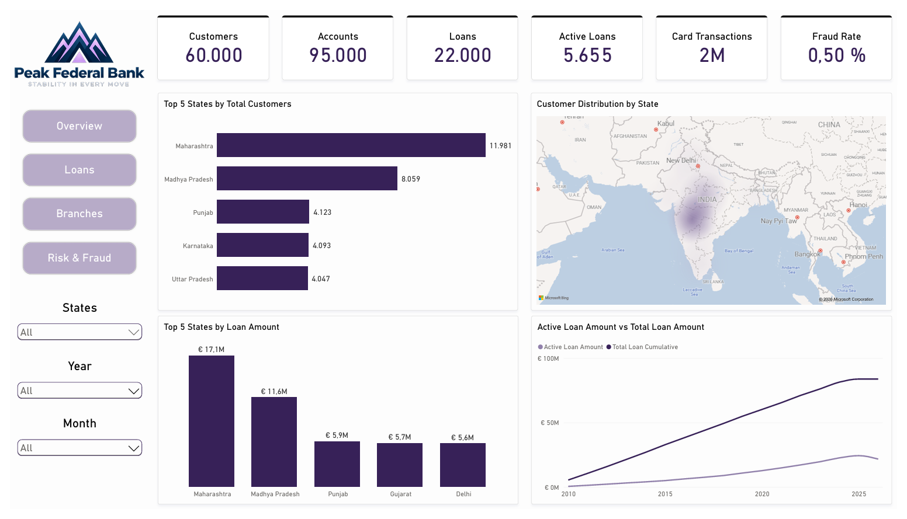

# Banking Analytics - Power BI Case Study (#05)

###### This case study was developed entirely in **Power BI** using a **synthetic randomized banking dataset** from Kaggle that does not represent any real bank.

## Executive Summary:
Using **Power Query**, I cleaned and prepared the data for analysis before building the **semantic model** in **Model View**. I established the necessary relationships and cardinalities between the tables and then created an interactive Power BI report with four pages: **Overview, Loan Performance, Branch Performance, and Risk & Fraud**.  
The report highlights key banking metrics and trends as:
1. **Loan performance and trends**
2. **Branch performance and customers**
3. **Risk and fraud analysis**

###### The final project is fully functional, connected, and tested, combining **data preparation, modeling, visualization, and analysis** in line with the core **PL-300 skills**.

## Objective:
This project aims to analyze the bank’s overall performance across its loan portfolio, branches, and financial risk areas. The analysis focuses on understanding how the loan portfolio is performing, identifying which branches are performing well or underperforming, and determining where the bank’s main areas of financial risk are. The goal is to provide insights that can help support informed business decisions.

**Key questions:**
1. **How is the loan portfolio performing?**
2. **Which branches are performing best, and where is performance weaker?**
3. **Where are the bank's main areas of financial risk?**

## Methodology:
1. **Use Power Query to clean, transform, and prepare the data for analysis**
2. **Build a semantic data model in Power BI and create DAX measures for loan, branch, and risk analysis**
3. **Build an interactive Power BI dashboard to visualize key metrics, trends, and insights**

## Power BI Skills:
**Power Query:** Data Cleaning & Transformation
**Data Modeling:** Relationships, Cardinalities & Filters
**DAX:** Measures, Calculated Columns & Calculated Tables
**Visualization:** Charts, KPI Cards, Tooltips & Visual Calculations
**Analysis:** KPI Analysis, Trend Analysis & Interactive Report Development

## Results & Business Recommendation:
This report gives stakeholders an interactive overview of the bank’s **loan portfolio, branch performance, and risk & fraud indicators**. Bringing these areas together in one report makes it easier to monitor key KPIs, identify trends, and compare performance across different years and locations without having to rely on separate manual analyses.

The analysis highlighted several key findings:

* **Loan Performance:** The analysis identified **5,655 active loans**, with a total active loan amount of **€21.6M**. The **NPL ratio of 10.5%** indicates that approximately **1 in every 10 loans is not performing as expected**.
* **Branch Performance:** The analysis identified **150 branches, 1,800 employees, and 60,000 customers**. **Maharashtra** stood out with the highest **total customer count (11.9K)** and **total loan amount (€17.1M)**.
* **Risk & Fraud:** The analysis identified **14,954 fraudulent transactions**, with the **Entertainment** merchant category recording the highest financial loss at **€18.9K**. However, the financial losses across the other merchant categories were also **relatively close**, indicating that fraud risk was not concentrated in a single category.

Based on these findings, I recommend the following actions:
1. **Monitor non-performing loans:** With an **NPL** ratio of **10.5%**, the bank should closely monitor non-performing loans and identify potential credit risks early.
2. **Review branch performance and resource allocation:** Since **Maharashtra** has the highest customer count and loan amount, the bank should review branch performance and ensure that resources are allocated effectively across all branches.
3. **Strengthen fraud monitoring across merchant categories:** Since fraud related losses are relatively similar across all merchant categories, the bank should maintain consistent fraud monitoring rather than focusing only on the Entertainment category.

I believe these recommendations would help the bank reduce potential credit risk, improve resource allocation across branches, and strengthen fraud monitoring across different merchant categories.

## Next Steps:
1. **Monitor loan and risk KPIs regularly**
2. **Investigate high-risk loans and suspicious transactions**
3. **Optimize branch resources based on performance insights**
